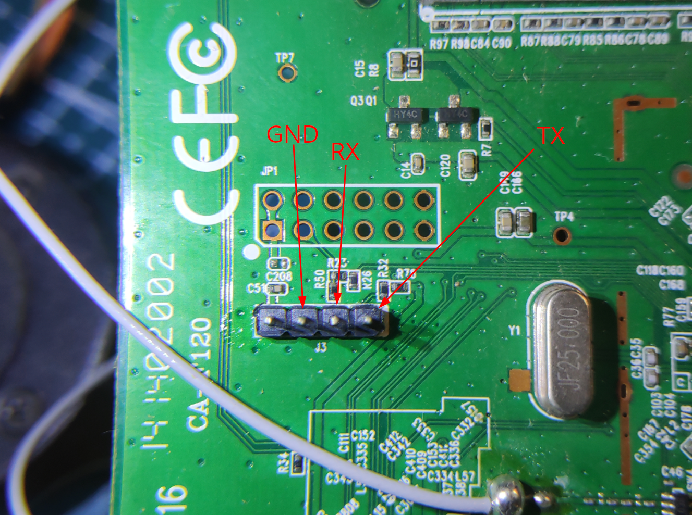

# TP-Link TL-WR841N

Boundrate: 115200

Testando o roteador TP-Link TL-WR841N, consegui visualizar o boot do dispositivo e fazer dump da memória flash.

Visualizar o boot de forma perfeitamente legível desde o início foi possivel usando o CP2101, uma vez que ao tentar com o CH340G, nas primeiras linhas do boot eu só recebia lixo, mas depois de um tempo o resto do boot era legível.

**Fotos do dispositivo internamente:**

## Monitorar porta serial

Para identicar quais eram os pinos da porta serial, consultei o projeto [TL-WR841N](https://github.com/adamhlt/TL-WR841N) que já havia feito o procedimento e o documentou.

Obtivi todo o boot do dispositivo de forma legível, no entando não consegui acesso a um shell, pois é necessário um login e senha que são desconhecidos.

https://github.com/henriquesebastiao/uart/assets/85202803/e952699f-385c-4440-abf8-56c88a756240

Você pode ver o log do boot do dispositivo no arquivo [bootlog.txt](bootlog.txt).
